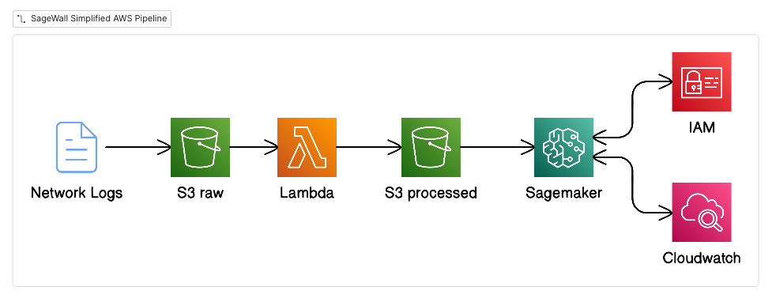
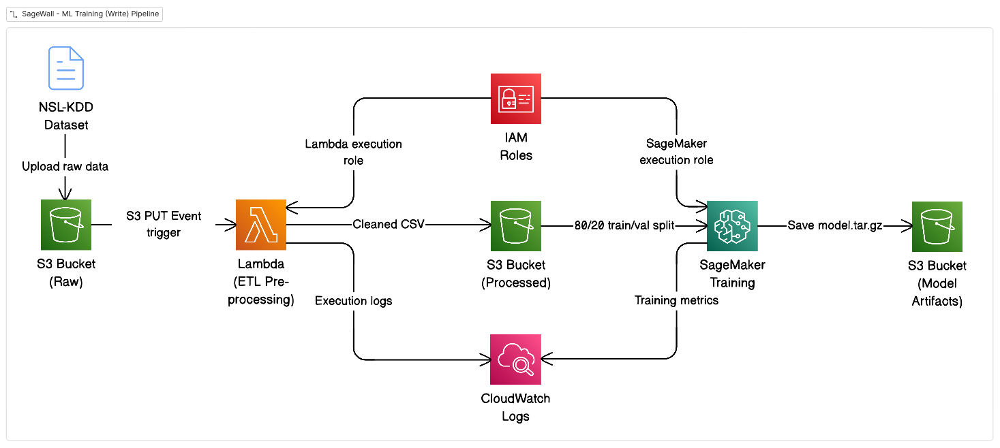
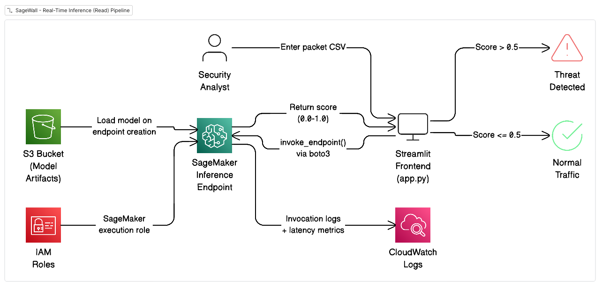

# SageWall

**Real-Time Network Intrusion Detection System using AWS SageMaker & XGBoost**


## ‼️ Read the DevLog ‼️

I documented the entire development process, technical decisions, and reasoning behind every design choice in the devlog. It covers the Write Path (setting up SageMaker), Read Path (including the Streamlit frontend), and all the lessons learned along the way. Fully authentic, no AI slop. I promise.

Check it out here: [devlog.md](devlog.md)

## About

Traditional firewalls use static rules, so they only catch attacks they already know about. SageWall uses machine learning to learn what "normal" network traffic looks like, so it can detect *new* attacks based on statistical anomalies.

## Summary

The overall architecture prepares the data in four stages:

1. Ingest: Raw network logs land in our first S3 bucket (sagemaker_raw).
2. Process: AWS Lambda triggers automatically to clean and format the logs.
3. Store: It extracts key features (Source IP, Port, Protocol) and saves the clean CSV to the processed S3 bucket (sagemaker_processed).
4. Train (this notebook): SageMaker pulls this processed data to train our XGBoost model.

## System Diagrams

### Simplified Architecture



### Training (Write) Pipeline



### Inference (Read) Pipeline




## Technical Details

- My first cloud engineering + ML project to teach myself AWS and machine learning. It detects network attacks (DoS, Probe, R2L, U2R) in real-time using XGBoost on SageMaker. 
- Designed and deployed a **serverless ML pipeline** on AWS (S3, Lambda, SageMaker, SNS) to detect network intrusions in real-time
- Trained an **XGBoost binary classifier** on 125,000+ NSL-KDD records, achieving **99.9% accuracy** with **<100ms inference latency**
- Built an **ETL pipeline** using AWS Lambda and Pandas to preprocess raw network logs (one-hot encoding, feature engineering, schema validation)
- Developed a **Streamlit web application** for real-time threat visualization and integrated **AWS SNS** for automated alerting on high-confidence detections
- Resolved production issues including Lambda memory optimization (128MB to 1024MB) and data type compatibility bugs in the ML pipeline

## Architecture

```
┌─────────────────┐      ┌─────────────────┐      ┌─────────────────┐      ┌─────────────────┐
│                 │      │                 │      │                 │      │                 │
│   S3 (Raw)      │─────▶│   Lambda ETL    │─────▶│   SageMaker     │─────▶│   Endpoint      │
│   Network Logs  │      │   Preprocessing │      │   XGBoost       │      │   Inference     │
│                 │      │                 │      │   Training      │      │   (<100ms)      │
└─────────────────┘      └─────────────────┘      └─────────────────┘      └─────────────────┘
        │                        │                        │                        │
        └────────────────────────┴────────────────────────┴────────────────────────┘
                                         │
                              ┌──────────┴──────────┐
                              │   Streamlit UI      │
                              │   + SNS Alerts      │
                              └─────────────────────┘
```

## Features

- **Streamlit Web App:** Clean UI to paste packet data and get instant threat predictions
- **Real-time Inference:** SageMaker endpoint responds in <100ms
- **SNS Alerting:** Sends email/SMS when threat confidence exceeds 90%
- **Fully Serverless:** No servers to manage; Lambda + SageMaker handle everything
- **Literate Notebook:** The training notebook reads like a tutorial, not just code

## Tech Stack

| Category | Technologies |
|----------|-------------|
| **Cloud** | AWS S3, Lambda, SageMaker, SNS, IAM, CloudWatch |
| **ML/Data** | XGBoost, Pandas, NumPy |
| **Frontend** | Streamlit |
| **SDK** | Boto3, AWS Data Wrangler |
| **Runtime** | Python 3.11 |

## Project Structure

```
SageWall/
├── app.py                    # Streamlit frontend (the UI!)
├── SageWall_Training.ipynb   # Literate programming notebook
├── aws/
│   └── lambda_function.py    # ETL preprocessing pipeline
├── utils/
│   ├── alerts.py             # SNS alerting module
│   └── __init__.py
├── docs/                     # Documentation & Guides
│   ├── beginners_guide.md
│   └── how_sagewall_works.md
├── assets/images/            # Screenshots
├── requirements.txt          # Python dependencies
└── README.md                 # You're reading this!
```

## Performance

| Metric | Value |
|--------|-------|
| **Accuracy** | 99.9% on validation set |
| **Inference Latency** | <100ms per packet |
| **Dataset** | NSL-KDD (125,000+ records) |
| **Attack Types** | DoS, Probe, R2L, U2R |

Sample output from the validation test:

```
Packet #1: Real=ATTACK | AI Confidence=0.9999 -> ✅ CAUGHT
Packet #2: Real=ATTACK | AI Confidence=0.9998 -> ✅ CAUGHT  
Packet #3: Real=ATTACK | AI Confidence=0.9999 -> ✅ CAUGHT
Packet #4: Real=Normal | AI Confidence=0.0003 -> ✅ CLEARED
Packet #5: Real=ATTACK | AI Confidence=0.9998 -> ✅ CAUGHT
```

## Quick Start

### Prerequisites
- AWS Account with SageMaker access
- Python 3.11
- AWS CLI configured (`aws configure`)

### Run the Streamlit App

```bash
# Clone the repo
git clone https://github.com/awzheng/SageWall.git
cd SageWall

# Install dependencies
pip install -r requirements.txt

# Run the app
streamlit run app.py
```

### Full Deployment

1. **Deploy Lambda** with the `AWSSDKPandas` layer and 1024MB memory
2. **Configure S3 trigger** to run Lambda on new uploads to your raw bucket
3. **Run the notebook** in SageMaker Studio to train and deploy the endpoint
4. **Connect the Streamlit app** by entering your endpoint name in the sidebar

Check the notebook (`SageWall_Training.ipynb`) for detailed step-by-step instructions. I wrote it like a tutorial so it's easy to follow.

## Dataset

**NSL-KDD:** The standard benchmark for intrusion detection research.

- 125,973 training records
- 41 features, 122 after one-hot encoding
- 5 classes: Normal, DoS, Probe, R2L, U2R

## Next Steps

- [ ] Add automated testing with pytest
- [ ] Deploy Streamlit app to AWS (EC2 or App Runner)
- [ ] Add confusion matrix visualization
- [ ] Try other models (Random Forest, Neural Net) for comparison

## About Me

**Andrew Zheng**  
1B Electrical & Computer Engineering  
University of Waterloo

Feel free to reach out if you have questions or suggestions!

## License

This project is licensed under the MIT License.
