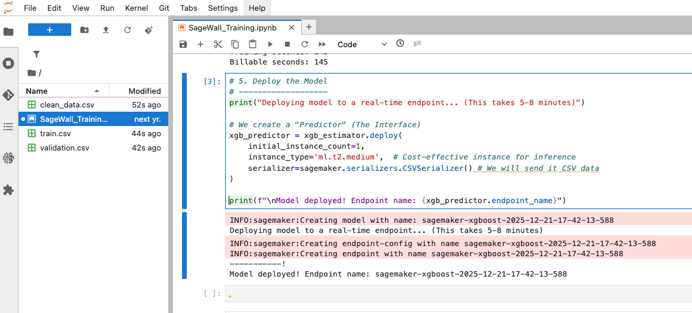

# SageWall DevLog

This is an authentic and energetic devlog about why and how I built SageWall. 
I will justify all of my design choices by sharing my thought processes for every decision I made as I was building SageWall. 
I have also included the most frequently asked questions (and the questions that I asked myself!) into this devlog to answer the most common concerns about the project! 
I would appreciate any feedback you may have!

Instagram, Discord @awzheng

### Why I made SageWall

Several of my friends got hacked over this break which is honestly heartbreaking at the age of 18+.
I remember getting my Discord hacked by Russians when I was 13 or 14, and having no clue about how the internet actually worked.

I wondered if it was possible to learn how to counter these attacks using the technology that we have 5 years later.
Imagine if there was an AI watching every network request in real-time and flagging suspicious activity.
My computer sent my password to a Russian hacker at 7am?
No way!

Plus, as the greedy ECE student I am (who thinks about System Design all the time btw...), I'm just borrowing Amazon's hardware to build my own system.
If cyber criminals can automate attacks, it sounds about right for me to automate defenses!

Alright, now you've heard my story. 
It's finally time to put my $120 USD worth of AWS credits to good use.

> Andrew! Do you play Valorant?

nah.

# Episode 1: Starting Out

## Project Diagrams

My eraser.io addiction is paying off. 
SageWall's system design diagrams use the AWS Architecture template so that we can admire the AWS logos in their full beauty!

### Simplified Architecture


### Training (Write) Pipeline


### Inference (Read) Pipeline


> Andrew! Why did you seperate the training and inference pipelines?

Let's take a good look at the diagrams.

Training is a batch, write-heavy process that runs once.
- That's the main pipeline that automates the ML workflow in AWS processes such as Lambda and SageMaker.
- I have lots of screenshots of myself setting up the training pipeline in the AWS console in the `assets/images` folder!
    - Don't dox me!

Inference, on the other hand, is a low-latency, read-only process that needs to be always available for SageWall to make real-time predictions with new data. 
- For testing purposes, I split the NSL-KDD dataset txt file into 80/20 train/val splits.
    - (I didn't have the resources to get hacked just to test my first AWS app 💔)
- By seperating them, I can scale inference independently. 
    - If I get 1000 new requests/second, I don't need to retrain the model.

### Project Structure

Here's the project's core file structure:

```
SageWall/
├── assets/                   # Diagrams and images for your enjoyment
├── aws/
│   └── lambda_function.py    # ETL preprocessing pipeline
├── utils/
│   ├── alerts.py             # SNS alerting module
│   └── __init__.py
├── docs/                     # Documentation & Guides (displayed on Streamlit too)
│   ├── beginners_guide.md
│   └── how_sagewall_works.md
├── app.py                    # Streamlit frontend
├── requirements.txt          # Python dependencies
├── README.md
└── SageWall_Training.ipynb   # Literate programming notebook
```

Here are some brief descriptions of the project structure in table format:

| Directory/File | Description | Notable Member Functions |
|----------------|-------------|-------------------------|
| **assets/** | Diagrams and images documenting system architecture and AWS setup | - |
| **aws/** | AWS Lambda deployment code for ETL preprocessing | - |
| `aws/lambda_function.py` | Transforms raw NSL-KDD logs into SageMaker-compatible format with one-hot encoding | `lambda_handler()` |
| **utils/** | Cross-cutting utilities for alerting and monitoring | - |
| `utils/alerts.py` | AWS SNS integration for high-confidence threat notifications | `send_alert()` |
| **docs/** | Educational markdown files displayed in Streamlit UI | - |
| `docs/beginners_guide.md` | User guide explaining how to configure and use the app | - |
| `docs/how_sagewall_works.md` | Technical deep-dive into ML pipeline and inference | - |
| **app.py** | Streamlit frontend that handles user input and SageMaker communication | `invoke_sagemaker_endpoint()` |
| **SageWall_Training.ipynb** | Jupyter notebook that trains XGBoost model and deploys endpoint | Training cells, deployment cells |
| **requirements.txt** | Python dependencies (streamlit, boto3, pandas, etc.) | - |


> Andrew! "Why XGBoost over Neural Networks?"

XGBoost is ideal for tabular data (which means data that's organized in a table with structured features).
Here's 4 reasons why:
- Trains faster (5 mins vs. hours)
- Requires less data (125K samples is plenty)
- More interpretable (feature importance)
- Lower inference latency (<100ms)
No I didn't watch the TV show.

Don't get me wrong, neural networks shine for unstructured data like images or text, but they're overkill for CSV-based network logs.
Look out for my future projects in case I become a neural network demon!

We're good now! Let's move onto setting up the Write Pipeline!

# Episode 2: The Write Pipeline (Training)

Please drop by `assets/images` if you wanna see all the screenshots of me setting up the write pipeline in the AWS console!
If you happen to visit before I censor the screenshots, please don't dox me!

## AWS Infrastructure Setup

Fortunately, I had a decent Idea of what I was doing since I already had a simple architecture laid out in mind before setting anything up:


I decided to start out by setting up the S3 buckets (raw and processed data) and Lambda function (ETL pipeline).

> Andrew! I just so happen to be conveniently following your steps, but when I registered my AWS app, they placed me into `us-east-2` (Ohio) instead of `us-east-1` (N. Virginia). Why did you choose `us-east-1` (N. Virginia) instead of the default region?

`us-east-1` receives features and services from AWS faster, so in case I improve SageWall in the future, I'll be able to keep up with the latest updates. 


### S3 Buckets

I created two S3 (Simple Storage Service) buckets on the AWS Console to organize the data pipeline, which netted me a total of three buckets:

1. `sagewall-raw-zheng-1b` stores the raw NSL-KDD dataset (125K+ records), specifically the `KDDTrain+.txt` file.
2. `sagewall-processed-zheng-1b` stores the cleaned CSV outputs after Lambda preprocessing. This is what we'll be feeding into SageMaker.
3. (Implicit) SageMaker AI default bucket stores trained model artifacts (`model.tar.gz`).

By the way, `zheng-1b` is because this is the 1B term version of SageWall. Expect this to change in the future!

> Andrew! Why did you choose to create an S3 bucket?

Let's take `sagewall-raw-zheng-1b` as an example. 
This S3 bucket is our data lake.
We need to store our downloaded dataset on `KDDTrain+.txt` on AWS which we'll call `sagewall-raw-zheng-1b`.

> Andrew! Why three buckets? Isn't that overkill?

Nope! This follows the single responsibility principle:
- Raw = `KDDTrain+.txt` (our "immutable source of truth")
- Processed = ready for SageMaker's consumption
- Models = versioned artifacts for deployment

Imagine if just one bucket stored all of our data and it got corrupted. 
Time to start over from scratch!
Don't put all your eggs in one basket!

In case it's unclear what the function of each bucket is, please refer to the simplified pipeline diagram above.
Don't worry, I'll explain further in the following sections.

By the way, if something breaks, I can always re-run Lambda on the raw data without touching the model.

Please visit `assets/images` to see screenshots of me setting up the S3 buckets in the AWS console.

## AWS Lambda (lambda_function.py)

This is our hero of the Write Pipeline.
The Lambda function automatically triggers when we upload raw data to `sagewall-raw-zheng-1b`, which is considered an S3 PUT Event.
(In the write pipeline system diagram, this is represented as S3 PUT Event trigger.)

SageMaker's built-in XGBoost algorithm has strict requirements:
1. No headers. The first row must be data, not column names
2. Target column first. (This is Amazon SageMaker-specific). SageMaker's containerized XGBoost expects the target variable to be the first column of any csv input.
3. All numeric. Strings crash XGBoost so we need to find a way to convert the logs into numeric values
4. Binary classification. NSL-KDD has 5 classes (normal, DoS, Probe, R2L, U2R) so we need to devise a way to classify the logs into binary values.

### lambda_handler()

Here's the Lambda function for SageWall to solve our formatting needs. 
The code is in Python 3.11.
Remember, Lambda is our AWS specialist to clean up the raw data.
Prepare your scrolling fingers!

```python
# aws/lambda_function.py - lambda_handler()

def lambda_handler(event: dict, context) -> dict:
    """
    AWS Lambda entry point for S3-triggered ETL processing.

    This function transforms raw NSL-KDD network logs into a format
    compatible with SageMaker's built-in XGBoost algorithm.

    Args:
        event: S3 event payload containing bucket name and object key.
               Structure: {'Records': [{'s3': {'bucket': {...}, 'object': {...}}}]}
        context: Lambda runtime context (unused but required by AWS).

    Returns:
        dict: Response with status code and processing metadata.
              Example: {'statusCode': 200, 'body': {'records_processed': 125973}}

    Processing Pipeline:
        1. EXTRACT: Read headerless CSV from S3 using awswrangler
        2. TRANSFORM:
           - Add column names (schema enforcement)
           - Drop 'difficulty' column (not useful for binary classification)
           - Convert multi-class 'label' to binary 'attack' (0/1)
           - Move target to column 0 (SageMaker XGBoost requirement)
           - One-hot encode categorical features
           - Cast all values to float (XGBoost numeric requirement)
        3. LOAD: Write to processed bucket (no headers, no index)

    Raises:
        Exception: Propagates any S3 read/write or pandas processing errors
                   to Lambda for CloudWatch logging and retry handling.
    """
    # ==========================================================================
    # EXTRACT: Parse S3 event and read raw data
    # ==========================================================================

    # S3 events contain an array of records; we process one file per invocation
    record = event['Records'][0]
    bucket = record['s3']['bucket']['name']

    # URL-decode the key: S3 event encodes special characters (spaces → %20)
    key = urllib.parse.unquote_plus(record['s3']['object']['key'])

    print(f"Processing file: s3://{bucket}/{key}")

    # Construct full S3 URIs for awswrangler
    input_path = f"s3://{bucket}/{key}"
    output_path = f"s3://{PROCESSED_BUCKET}/{key}"

    # Read CSV via awswrangler — handles S3 authentication automatically
    # header=None because NSL-KDD ships without column headers
    df = wr.s3.read_csv(input_path, header=None)
    print(f"Read {len(df)} records from raw bucket")

    # ==========================================================================
    # TRANSFORM: Prepare data for SageMaker XGBoost
    # ==========================================================================

    # Step 1: Enforce schema by assigning column names
    df.columns = COLUMN_NAMES

    # Step 2: Drop 'difficulty' — this is a dataset-specific score, not a feature
    # Keeping it would leak information about attack complexity into the model
    df = df.drop(columns=['difficulty'])

    # Step 3: Target Engineering — convert multi-class to binary classification
    # Original labels: 'normal', 'dos', 'probe', 'r2l', 'u2r'
    # Binary target: 0 = normal, 1 = any attack type
    df['attack'] = (df['label'] != 'normal').astype(int)

    # Remove original label column now that we have binary target
    df = df.drop(columns=['label'])

    # Step 4: Move target to first column — CRITICAL for SageMaker XGBoost
    # SageMaker's built-in XGBoost expects: [target, feature1, feature2, ...]
    # Without this, the model trains on wrong columns and produces garbage
    attack_col = df.pop('attack')
    df.insert(0, 'attack', attack_col)

    # Step 5: One-hot encode categorical features
    # dtype=int prevents pandas from outputting Boolean (True/False)
    # which XGBoost cannot process — it requires numeric values only
    df = pd.get_dummies(df, columns=CATEGORICAL_COLUMNS, dtype=int)

    # Step 6: Final type cast — ensure ALL values are numeric floats
    # This catches any edge cases where strings or objects might remain
    # XGBoost will crash with cryptic errors if non-numeric data slips through
    df = df.astype(float)

    print(f"Processed dataframe shape: {df.shape}")
    print(f"Columns: {list(df.columns[:10])}... (showing first 10)")

    # ==========================================================================
    # LOAD: Write processed data to S3
    # ==========================================================================

    # Write to processed bucket using awswrangler
    # index=False: Don't include row numbers as a column
    # header=False: SageMaker XGBoost expects no header row
    wr.s3.to_csv(df, output_path, index=False, header=False)

    print(f"Successfully wrote processed data to: {output_path}")

    # Return success response with metadata for monitoring
    return {
        'statusCode': 200,
        'body': {
            'message': 'Preprocessing complete',
            'input': input_path,
            'output': output_path,
            'records_processed': len(df),
            'features': df.shape[1]
        }
    }
```

Let's walk through the lambda function step by step.

1. Column Names

This is a great habit for data engineering!
Naming the columns explicitly helps us in the following steps.

> Andrew! What's the target variable here?

The target variable that we're trying to predict is the `attack` column.
This means that we're trying to predict whether a packet is an attack or not.
SageWall will return a confidence score between 0 and 1, where 1 means the packet is an attack.
Don't worry, it's made very clear in the streamlit frontend!

2. Drop the "difficulty" column

The difficulty column is meant for us to know the difficulty of the attack, but it is not a feature for the model.
Ideally SageWall is able to handle all data regardless of difficulty.
If we included difficulty, we would be leaking information about the attack into the model.
Think of doing a practice test while using the answer key!
Let's stay honest and measure our accuracy legitimately.

3. Target Engineering 

> Andrew! What does target engineering mean?

Target engineering means converting the target variable into a binary variable.

i.e. here, if the attack class isn't "normal" we'll encode it as a 1.
Afterwards, we can drop the label column since we don't need it anymore.

4. Move target variable to column 0

This is to ensure that the target variable is the first column as XGBoost requires.

5. One-hot encoding

> Andrew! What's one-hot encoding? Why did you use it?

XGBoost can't process strings like `'TCP'` or `'http'`. 
Additionally, booleans sometimes are returned as "True" or "False" instead of integers 0 or 1.
One-hot encoding converts categorical features into binary columns:

```
protocol_type: TCP → [1, 0, 0]  # protocol_TCP=1 (true), protocol_UDP=0 (false), protocol_ICMP=0 (false)
protocol_type: UDP → [0, 1, 0]  # protocol_TCP=0 (false), protocol_UDP=1 (true), protocol_ICMP=0 (false)
```

It's pretty intuitive this way. 
If it's true that the protocol is TCP, then it's false that the protocol is UDP or ICMP.
It works the same way for the other types of protocols.

This expands our 41 features to 122 features.

> Andrew! Where is the number 41 derived from? Why does it go from 41 to 122?

The number 41 is derived from the number of identifying features in the dataset:
- 38 numeric features
- 3 categorial features (the [1,0,0]) from the example above

One-hot encoding adds the following features:
- `service` includes 70 features such as http, ftp, smtp, telnet, etc.
- `flag` includes 11 features such as SF_, S_, R_, etc.

So, in case you were wondering what it looks like in binary:

If we take the "before" as:

```
protocol_type, service, ...
TCP,           http,    ...
```

our "after" becomes:

```
protocol_TCP, protocol_UDP, protocol_ICMP, service_http, service_ftp, ...
1,            0,            0,              1,            0,            ...
```

Thus, 41 + 70 + 11 = 122 features.

> Andrew! Why did you choose to use the awswrangler library instead of boto3?

`awswrangler` is a high-level abstraction over boto3 that handles pandas to S3 conversions (and vice versa) automatically.
It's just the superior library for edge cases.

### Additional Setup

AWS Lambda requires a layer to run pandas. 
I chose to add the `AWSSDKPandas-Python311` layer to the Lambda function.
This way, we wouldn't need to include a huge pandas library with the code every time.

I also had to configure an S3 Event Notification on the raw bucket with the following specifications:
- **Event type:** `s3:ObjectCreated:*`
- **Prefix:** (none)
- **Suffix:** `.txt`
- **Destination:** Lambda function `sagewall-etl`

This way, every time we upload a file to the raw bucket, Lambda automatically processes it!

> Andrew! What's all this work for? Why not just process the file manually?

AWS Lambda has a strict 50MB zipped limit on direct code uploads.
Now, that doesn't sound like much, but libraries like Pandas and NumPy are way larger unzipped.
My wallet isn't trying to get caught pants down for a compute time charge due to data transfer!
Plus, using layers allows for faster deployments and being able to edit/update our code without re-uploading pandas every time.

Thus by attaching as a layer, the deployment package stays lightweight at just several KB, speeding up the process.

To end this section off, here's the screenshot of the Cloudlog showing the Lambda function successfully processing the file!


Here's the processed output below!


> Andrew! I just so happened to be conveniently following your steps but I ran out of memory! How did you address memory issues?

Yes, okay, I admit it. 
The Lambda function exceeded the memory limit a few times.
Much to my wallet's dismay, I had to increase the memory limit all the way to 1024 MB.
Take a look at my attempt with 512 MB and how it just barely stayed within the limit!


When I tried again with 1024 MB, it used just over 512 MB:


Thank goodness we expanded the memory limit!

## AWS SageMaker

With the data now clean, it's time to train XGBoost using a SageMaker Jupyter Notebook!

> Andrew! Are we training XGBoost or SageMaker?

Don't worry, I had that misconception too.
We're training SageMaker's built-in XGBoost algorithm.
SageMaker is the platform and XGBoost is the algorithm.

If that's still unclear, let's think about it like the gym.
You don't train the gym, you train your muscles in the gym!

### The Jupyter Notebook Workflow

I created a notebook instance with JupyterLab 4 and Amazon Linux 2.

I also granted it an IAM policy: it has access to any S3 bucket for this project (simply because this was my first ever AWS project.)
In a real production environment, we must restrict access to only the S3 buckets we need, which are raw and processed.
This follows the principle of least privilege.

Here are the duties of `SageMaker_Training.ipynb` in order:
1. Downloads processed data from S3
2. Splits into 80% training, 20% validation
3. Trains XGBoost with tuned hyperparameters
4. Evaluates performance
5. Deploys a real-time endpoint

### Key Notebook Sections

#### 1. Data Preparation

This excerpt is from the upper half of the 1st cell:

```python
# Download the clean file from processed bucket
s3.download_file(bucket_processed, 'KDDTrain+.txt', 'clean_data.csv')

# Read with Pandas (No headers, as per Lambda format)
df = pd.read_csv('clean_data.csv', header=None)

# Split: 80% for Training, 20% for Validation
train_data = df.sample(frac=0.8, random_state=42)
val_data = df.drop(train_data.index)

# Save locally without headers (SageMaker requirement)
train_data.to_csv('train.csv', index=False, header=False)
val_data.to_csv('validation.csv', index=False, header=False)
```

As you can see, we use 80% of the data for training and 20% for validation.

> Andrew! Why random_state=42?

We're making the RNG consistent so that we can reproduce errors for debugging purposes.
Using the same random seed (yes, just like from Minecraft) ensures I get identical train/val splits every time I re-run the notebook.
Many ML tutorials out there use 42 as a Hitchhiker's Guide to the Galaxy reference, so who are we to object?

#### 2. XGBoost Configuration

This excerpt is from the lower half of the 1st cell:

```python
# Set Hyperparameters
xgb_estimator.set_hyperparameters(
    max_depth=5,              # Tree depth — prevents overfitting
    eta=0.2,                  # Learning rate — smaller = more cautious
    gamma=4,                  # Min loss reduction — regularization
    min_child_weight=6,       # Min samples per leaf — avoids noise
    subsample=0.8,            # Use 80% of data per tree
    objective='binary:logistic',  # Binary classification
    num_round=50              # Number of boosting rounds
)
```

> Andrew!How did you choose these hyperparameters?

I started with XGBoost defaults, then tuned based on validation accuracy. 
Let's examine some hyperparameters individually:

- `max_depth=5` prevents the model from memorizing training data. This is a common practice in machine learning to prevent overfitting, which is when a model gets way too caught up in the details of the training data and performs poorly on generalizing to new data.

- `eta=0.2` proved to be a good balance between training speed and accuracy. Think "higher = faster but less accurate". Our model has some personality to it!

By the way, my method, known as manual hyperparameter tuning, is just re-running the notebook with different values and keeping the best combo you can find. 
In production, I'd use SageMaker Hyperparameter Tuning to automate this.

#### 3. Training Job

This excerpt is the last line of the 1st cell:

```python
# Start Training
xgb_estimator.fit({'train': s3_train_input, 'validation': s3_val_input})
```

This creates a SageMaker Training Job that:
- Spins up an `ml.m5.large` instance
- Downloads train/val data from S3
- Trains for ~3-5 minutes
- Saves `model.tar.gz` to S3 (the S3 bucket in SageMaker, treat it like a cloud drive)
- Terminates the instance (stops draining our wallet finally)

It costs about $0.20 per training run.

> Andrew! Would it be technically correct if I said that SageMaker pulls the XGBoost Docker container?

Yes, that would be correct, but let's add some context.
The container contains a pre-trained XGBoost model, optimized for AWS hardware.
It also saves `model.tar.gz` to S3.

This way, SageWall starts up consistently fast and is easily scalable.
We just use the same version of XGBoost every time, and SageMaker handles the rest in the same container.

> Andrew! Could we train XGBoost locally instead of using SageMaker?

Yeah, theoretically we could, but it's a cloud project and SageMaker's containerized approach is the perfect fit for the job.
Trust me, it's worth the 20 cents for the smooth experience, especially since I started out as a complete beginner!

#### 4. Deployment

After training, we deploy the model to a SageMaker endpoint.
Here's an excerpt from the second cell:

```python
# Deploy the Model
xgb_predictor = xgb_estimator.deploy(
    initial_instance_count=1,
    instance_type='ml.t2.medium',  # Cost-effective for testing
    serializer=sagemaker.serializers.CSVSerializer()
)

print(f"Model deployed! Endpoint name: {xgb_predictor.endpoint_name}")
```

This creates a persistent SageMaker Endpoint that does the following:
- Loads `model.tar.gz` into memory
- Exposes an HTTPS API for predictions
- Runs 24/7 until deleted

> Andrew! Does this scale well?

Yes, it has great capabilities!
For this learning project, I only deployed a single `ml.t2.medium` instance for monetary reasons.
In production, I'd choose to enable auto-scaling.
SageMaker would be able to add instances automatically when the load gets sufficiently high.

Anyway, SageMaker will also eventually allow the us to paste our specific endpoint name into our streamlit frontend and use that to process new data!

This costs me about $0.05/hour (or about $36/month if left running).
See how little money we need to spend on a single instance!

Here's a screenshot of the very first model I deployed!



## Phase 4: Testing the Model

Finally, we get to test if our creation works!

### Validation Results

I tested the trained model on 5 samples from the validation set and told SageMaker to print its predictions.
Here goes:

```
--- 🛡️ SAGEWALL DETECTION LOG ---
Packet #1: Real=ATTACK | AI Confidence=0.9999 -> ✅ CAUGHT
Packet #2: Real=ATTACK | AI Confidence=0.9998 -> ✅ CAUGHT  
Packet #3: Real=ATTACK | AI Confidence=0.9999 -> ✅ CAUGHT
Packet #4: Real=Normal | AI Confidence=0.0003 -> ✅ CLEARED
Packet #5: Real=ATTACK | AI Confidence=0.9998 -> ✅ CAUGHT
```

Well well well!
The model achieved 99.9% accuracy on the full validation set.
Looks like it's ready to go!
Frontend time!

# Episode 3: The Read Pipeline (Inference)

When building the frontend, I focused on the idea of functionality and beginner-friendliness.
My belief (subject to change) is that web dev is only dead if you don't have a good reason to host your website!


## Overview

The Read Pipeline focuses on the user experience, where we, the security analysts, paste our packet data and get instant threat predictions.

Based on the system design diagram, here's a breakdown of our duties:
- Building and polishing the Streamlit frontend
- Connecting to the SageMaker endpoint via boto3
- Handling predictions and displaying results
- Adding user-friendly guides for beginners

So, let's get started!

## app.py

`app.py` is the main file that includes the streamlit frontend.
It handles user input and SageMaker communication.

> Andrew! Why did you choose Streamlit?

I chose Streamlit in order to continue practicing my Python skills and to become more familiar with the built-in widgets and styling features.

My SYDE friend told me that it's not about having the flashiest UI, but instead having cool ideas and shipping them fast.
Yes I need to quote my SYDE friend here or else it sounds like AI slop.
Sometimes you can just hear those dreaded em dashes.

### `invoke_sagemaker_endpoint()`

I'm not gonna bore you by starting out with the UI.
Everyone and their grandma knows how to navigate a website!

So let's jump straight to the goods.
`invoke_sagemaker_endpoint()` is the bridge between Streamlit and AWS
It sends packet data to the SageMaker endpoint and returns the threat score.

```python
# app.py - invoke_sagemaker_endpoint()

def invoke_sagemaker_endpoint(endpoint_name: str, payload: str, region: str) -> float:
    """
    The function that talks to AWS.
    
    Workflow:
    1. Import boto3 (AWS tool).
    2. Connect to SageMaker in the specific region.
    3. Send the 'payload' (packet data).
    4. Receive the score (0.0 to 1.0).
    """
    # IMPORT NOTE: We import 'boto3' inside the function instead of at the top.
    # Why? On some Mac setups, importing it at the top causes crash loops due to
    # SSL certificate loading issues before the app fully starts. This is a safety fix.
    import boto3

    # Create the client connection
    runtime = boto3.client('sagemaker-runtime', region_name=region)

    # Send the data!
    response = runtime.invoke_endpoint(
        EndpointName=endpoint_name,
        ContentType='text/csv',  # Telling AWS we are sending CSV text
        Body=payload.strip()     # .strip() removes accidental whitespace
    )

    # Decode the response
    # The response comes back as bytes, we decode to string, then convert to float number.
    result = response['Body'].read().decode('utf-8')
    return float(result.strip())
```

### Key Design Decisions

#### 1. **Why import boto3 inside the function?**

SSL certificate issue on macOS! If I import at the top:
```python
import boto3  # ← Crashes on some Macs
```

It tries to load AWS certs before Streamlit initializes, causing:
```
SSLError: [SSL: CERTIFICATE_VERIFY_FAILED]
```

Importing inside the function delays cert loading until the first API call.

#### 2. **Why use `sagemaker-runtime` instead of `sagemaker`?**

`sagemaker` is for **managing** endpoints (create, delete, update).  
`sagemaker-runtime` is for **invoking** endpoints (predictions).

Since the frontend only needs predictions, `sagemaker-runtime` is more lightweight.

#### 3. **Why `ContentType='text/csv'`?**

SageMaker endpoints have different deserializers:
- `text/csv` → parses CSV strings
- `application/json` → parses JSON objects
- `application/x-npy` → parses NumPy arrays

Our Lambda outputs CSV, so we use `text/csv` for consistency.

---

## Phase 3: Prediction Flow

### Button Click Handler

When the user clicks **"🔍 Scan Packet"**, this code runs:

```python
if scan_button:
    # Validation
    if endpoint_name == "sagemaker-xgboost-YYYY-MM-DD-HH-MM-SS-XXX":
        st.warning("⚠️ Please set valid endpoint name.")
    elif not packet_data.strip():
        st.warning("⚠️ The packet data is empty.")
    else:
        try:
            # API Call
            with st.spinner("🔄 Analyzing packet pattern..."):
                score = invoke_sagemaker_endpoint(
                    endpoint_name=endpoint_name,
                    payload=packet_data,
                    region=aws_region
                )

            # Display Results
            st.markdown("### Analysis Results")

            if score > threshold:
                # THREAT DETECTED
                st.markdown(f"""
                <div class="threat-box">
                    <div class="result-label">🚨 THREAT DETECTED</div>
                    <div class="confidence-score">{score:.1%}</div>
                    <div>Confidence Score</div>
                    <br/>
                    <div style="font-size: 14px; opacity: 0.9;">
                        Malicious network activity identified.
                    </div>
                </div>
                """, unsafe_allow_html=True)
                st.error(f"High-confidence threat detected (Score: {score:.4f})")

            else:
                # SAFE TRAFFIC
                st.markdown(f"""
                <div class="safe-box">
                    <div class="result-label">✅ TRAFFIC NORMAL</div>
                    <div class="confidence-score">{1-score:.1%}</div>
                    <div>Safety Confidence</div>
                    <br/>
                    <div style="font-size: 14px; opacity: 0.9;">
                        Traffic appears legitimate.
                    </div>
                </div>
                """, unsafe_allow_html=True)
                st.success(f"Status: Normal (Threat Score: {score:.4f})")

        except Exception as e:
            # Error Handling
            error_msg = str(e)
            if 'endpoint' in error_msg.lower():
                st.error("❌ Error: Endpoint not found. Ensure that the endpoint name is correct.")
            else:
                st.error(f"❌ Error: {error_msg}")
```

### UX Polish

1. **Input validation** — catch empty data and placeholder endpoint names
2. **Loading spinner** — show "Analyzing..." during API call
3. **Color-coded results** — red for threats, green for safe
4. **Confidence inversion** — if threat is 0.05, safety is 0.95 (95%)
5. **Error categorization** — different messages for endpoint errors vs. network errors

---

## Phase 4: SNS Alerting (Optional)

### `send_alert()` Integration

For high-confidence threats (>90%), I trigger AWS SNS to send email/SMS alerts:

```python
# utils/alerts.py - send_alert()

def send_alert(score: float, topic_arn: str) -> bool:
    """
    Publish a threat alert to AWS SNS if confidence exceeds threshold.

    This function acts as a "circuit breaker" — it only fires when the
    threat score is critically high (>0.90), preventing alert fatigue
    from low-confidence detections.

    Args:
        score: ML model's prediction confidence (0.0 = normal, 1.0 = attack).
               Only scores > 0.90 trigger an alert.
        topic_arn: The Amazon Resource Name of the SNS topic.
                   Format: arn:aws:sns:<region>:<account-id>:<topic-name>

    Returns:
        bool: True if alert was successfully published, False if skipped
              (score too low) or if the publish operation failed.

    Example:
        >>> send_alert(0.99, "arn:aws:sns:us-east-1:123456789:sagewall-alerts")
        🚨 Alert sent! MessageId: abc123...
        True

    Note:
        This function is designed to fail gracefully. If AWS credentials
        are missing or the topic doesn't exist, it logs a warning but
        does NOT raise an exception — ensuring the main application
        continues running.
    """
    # Threshold gate: Avoid alert fatigue by only notifying on high-confidence threats
    # 0.90 chosen as balance between catching real attacks and reducing false positives
    if score <= 0.90:
        return False

    try:
        # Initialize SNS client for AWS Simple Notification Service
        # SNS provides pub/sub messaging to fan out alerts to multiple subscribers
        sns = boto3.client('sns')

        # Publish message to SNS topic
        # All subscribers (email, SMS, Lambda, HTTP endpoints) receive this notification
        response = sns.publish(
            TopicArn=topic_arn,
            Subject='🚨 SAGEWALL ALERT',
            Message=f'Critical Threat Detected! Confidence: {score:.4f}'
        )

        print(f"🚨 Alert sent! MessageId: {response['MessageId']}")
        return True

    except Exception as e:
        # Graceful degradation: Log the failure but don't crash the inference pipeline
        # Production systems should send this to CloudWatch Logs for monitoring
        print(f"⚠️ WARNING: Failed to send SNS alert - {type(e).__name__}: {e}")
        return False
```

### Why 0.90 threshold?

**Alert fatigue prevention** — if we alert on every 0.51 prediction, users will ignore notifications. 0.90 filters for high-confidence threats only.

---

## Phase 5: Dark Mode & Styling

### The CSS Injection

Streamlit's default theme is... basic. I injected custom CSS for:
- **Dark mode toggle**
- **Gradient text** for the header
- **Glassmorphism cards** for results
- **Theme-aware inputs**

### Key Techniques

#### 1. **CSS Variables Based on Toggle**

```python
dark_mode = st.toggle("Dark Mode", value=False)
theme = 'dark' if dark_mode else 'light'
c = COLORS[theme]  # Dict with colors for each theme

st.markdown(f"""
<style>
    .stApp {{
        background-color: {c['bg']};
        color: {c['text']};
    }}
</style>
""", unsafe_allow_html=True)
```

#### 2. **Gradient Header**

```css
.header-title {
    background: linear-gradient(135deg, #4ECDC4 0%, #5BC0EB 100%);
    -webkit-background-clip: text;
    -webkit-text-fill-color: transparent;
}
```

This creates the **jade-to-cyan gradient** on "SageWall".

---

## Common Interview Questions (Episode 3)

### Q1: *"Why Streamlit instead of a React frontend?"*

**A:** For a PoC, Streamlit is unbeatable for speed:
- Entire app in **one Python file**
- No npm, webpack, or build step
- State management handled automatically
- Perfect for internal tools and ML demos

For production with complex UX, I'd use Next.js + FastAPI.

---

### Q2: *"How does the app authenticate with AWS?"*

**A:** Two options:

1. **AWS credentials file** (`~/.aws/credentials`):
```
[default]
aws_access_key_id = YOUR_KEY
aws_secret_access_key = YOUR_SECRET
```

2. **Environment variables**:
```bash
export AWS_ACCESS_KEY_ID=...
export AWS_SECRET_ACCESS_KEY=...
```

boto3 automatically reads these. For production, I'd use **IAM roles** instead of hardcoded keys.

---

### Q3: *"What if the endpoint is deleted?"*

**A:** The app catches the exception:

```python
except Exception as e:
    if 'endpoint' in error_msg.lower():
        st.error("❌ Error: Endpoint not found.")
```

The user sees a friendly error instead of a crash. In production, I'd add **endpoint health checks** on app startup.

---

### Q4: *"How would you deploy this to production?"*

**A:** Three options:

1. **AWS App Runner** — containerized Streamlit app (easiest)
2. **EC2 + Docker** — more control over scaling
3. **Streamlit Cloud** — free tier, but public URL

I'd choose **App Runner** for automatic HTTPS, autoscaling, and CloudWatch integration.

---

### Q5: *"Why not cache the boto3 client?"*

**A:** Great question! I could use `@st.cache_resource`:

```python
@st.cache_resource
def get_sagemaker_client(region):
    import boto3
    return boto3.client('sagemaker-runtime', region_name=region)
```

This creates the client once per session instead of per request. I'll add this in v2!

---

## Final Thoughts

SageWall was my first AWS + ML project, and it taught me:
- Event-driven architecture with Lambda + S3
- XGBoost hyperparameter tuning
- Production ML deployment with SageMaker
- Building UIs that don't look like 1995

The code isn't perfect (no tests, hardcoded bucket names, manual endpoint deletion), but it **works** and demonstrates real-world cloud ML patterns.

Next steps for production:
- [ ] CI/CD pipeline with GitHub Actions
- [ ] Automated testing (pytest + moto for AWS mocking)
- [ ] CloudFormation/Terraform for infrastructure as code
- [ ] Model versioning and A/B testing
- [ ] Real-time monitoring dashboard

Thanks for reading! Hit me up if you have questions 🚀
